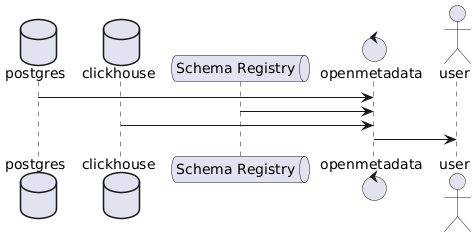
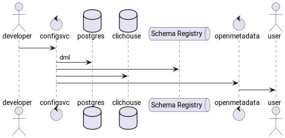

# Каталог данных 
Каталог данных на абстрактном уровне - это перечень данных с описанием их структуры и прочей информации о данных.

Проявления разных каталогов могут иметь разную функциональность и решать разные задачи

- СУБД Oracle, Postgres, Vertica и многие другие - содержат ряд внутренних, доступных на чтение view, которые предоставляют два типа информации о данных. Структура данных и описание событий над данными
Первое обеспечивает внутренние процессы связанные с поддержанием структурной целостности данных, второе как правило метрики оптимизатора запросов и мониторинг

- Hive metastore - обладает аналогичной функциональностью, но для систем с раздельным хранением и вычислительной частью. Hive, Spark, Trino

- Schema Registry - Как правило имеет узкое применение вместе с kafka, но в теории может быть применен и вне. Содержит структурное описание объектов

- [OpenMetadata](https://open-metadata.org). Назначение в текущем контексте - быть удобным посредником между технологическими описаниями и пользователем - потребителем данных. 
Для пополнения метаданными применяется как rest-API, Так и широкий спектр загрузчиков для разных СУБД и систем управления очередями. Есть интерфейс для пользователя, чтобы составлять описания

-  [Сервис управления конфигурацией](ConfigManagement.MD) - внутренний каталог предлагаемого подхода, так же хранит метаданные объектов, и конфигурации процессов над ними. 
Данный сервис может стать единственным поставщиком метаданных всех хранилищ находящихся под его управлением в openmetadata.
   Кроме того сервис конфигурации может быть использован для поддержки изменений в других СУБД. Плюсы данного подхода в том, что все настройки и описания пользователь поставляет в едином формате, через систему контроля версий. А система сама раскидывает конфигурации по всем участникам
 
