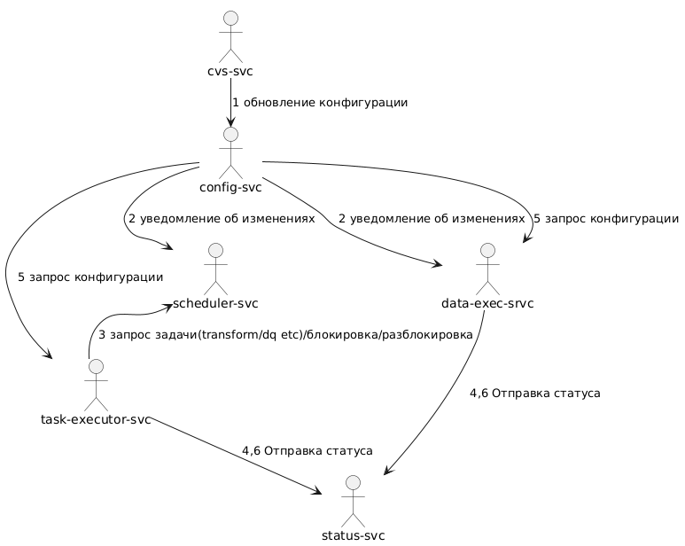
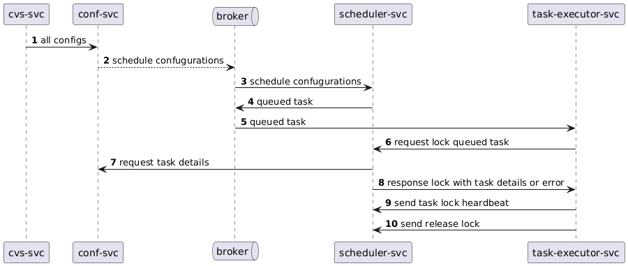

# Управление данными
Главные компоненты системы управления данными:

## [Управление конфигурацией](DataManagement/ConfigManagement.MD)
Входная точка для внесения изменений в систему

## [Сервис взаимодействия с системами контроля версий](DataManagement/CVSService.MD)
Варианты поставки конфигурации могут быть разными. В самом простом варианте работы ad-hoc это может быть прямая отправка измененных конфигураций.
Но лучше произвести интеграцию между, как пример git репозиторием и сервисом конфигурации. Так мы дополнительно получаем возможность проводить ревью и добавлять различные валидации.

## [Процессы изменения данных](DataManagement/AbstractEntities/Process.MD) 

### [Планирование расписаний](DataManagement/Scheduler.MD)
Способность планировать периодичные задачи.

### [Cервисы непрерывной интеграции данных](DataManagement/DataService.MD)
Не все данные можно доставлять по расписанию. В некоторых случаях требуется более быстрая, близкая к онлайн обработка и даже обогащения

## [Качество данных](DataManagement/DataQuality.MD)
Включает в себя проверку ожиданий, контроль структурной целостности и контроль [статусов инкрементов](DataManagement/DataSetStatusModel.MD)

## [Статусная модель дасетов](DataManagement/DataSetStatusModel.MD)
Функционал, который на основе конфигурации о зависимостях может освободить пользователя от необходимости придумывать порядок работы с зависимостями и контролировать состояние интервалов и  инкрементов.

## Мониторинг

### Сбор статистики

* Интерфейс метаданных конечного пользователя данных

Примерно это может выглядеть так

и работать в такой последовательности 

